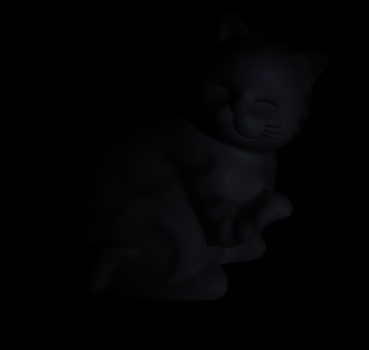
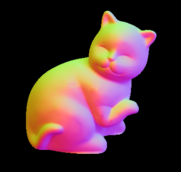

# **Photometric 3D Reconstruction**

## **Introduction**
Photometric 3D reconstruction is the process of reconstructing the 3D shape of an object from a set of 2D images captured under varying illumination conditions. In this process, the appearance of the object in each image is affected by factors such as lighting conditions, camera parameters, and object geometry. 

Using 96 different images of a cat, I want to create its 3D object.

---

## **Tools**
- **OpenCV** (Open Source Computer Vision): is a library that can be used to develop real-time computer vision applications. It provides tools and functions to perform tasks such as image processing, object detection, face recognition, tracking, and video analysis. 
- **Numpy**  (Numerical Python): is a Python library for numerical computing that provides tools for working with multi-dimensional arrays and matrices, along with a large collection of high-level mathematical functions to operate on these arrays. 
- **Matplotlib** is a Python library for creating static, interactive, and animated visualizations in Python. It provides a wide range of tools for data visualization and plotting graphs such as line charts, scatter plots, histograms, bar charts, and more.
---
## **Dataset**
To implement this project, we used :
- 96 images of the same object taken by the same camera position but with different conditions
(positions and intensities) of the light source. These images are stored in RGB (BGR under
opencv) on 16 bits.
- A file contains the names of the 96 images already mentioned. (filenames.txt).
- A file contains the positions of the light sources. (light_directions.txt).
- A file contains the intensities of the light sources. (light_intensities.txt).
- An image contains the object's mask (mask.jpg).
---

## **Steps**
To create the 3D object I followed the following steps:
### **1. Normalization**
- Normalize images values from **unit16** to **float32** : it helps to eliminate the effects of lighting variations on the appearance of the object being reconstructed.
- Divide each pixel by the correspending light intensity : remove the effect of the lighting conditions on the image to have a consistent level of image intensities, which makes it easier to reconstruct the 3D structure of the object.
- Convert images into grey scale : which simplifies the image, reduces the amount of data that needs to be processed, improves the accuracy of the 3D reconstruction process, and increases its efficiency.
### **2. Reconstruction of the 3D object**
- Calculate the **needle map** : a representation of the surface normals of the object being reconstructed. The calculation of the needle map is an important step because it provides information about the orientation of the surface at each pixel in the image.
- Estimate the **depth** or **z-coordinate** using the needle map : typically refers to the distance of a point in a 3D scene from the camera. In other words, the "z coordinate" represents the third dimension of a point in the 3D space, with the other two dimensions being the x and y coordinates.

## **Screenshots**
1. One of 96 images

2. The 2D object extracted from the 96 normalized images 

3. The 3D object extracted by calculating the needle map and the z-coordinate

